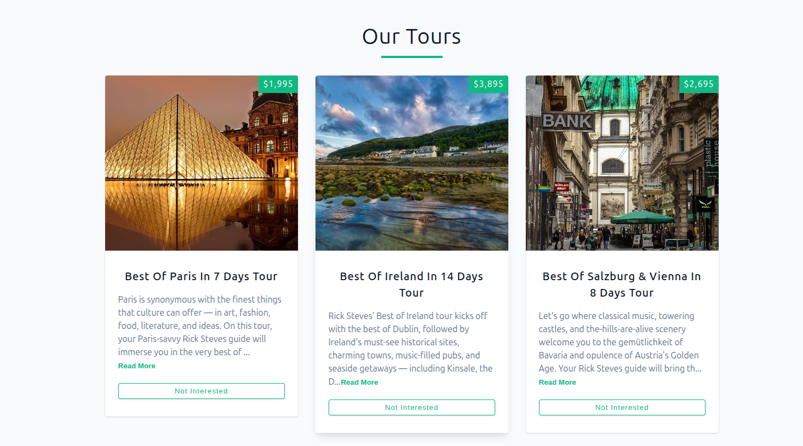

# Tours Project 🧳


A React practice project focused on practice fundamental hooks and API integration. Displays tour information with interactive features for a dynamic user experience.



## ✨ Features

- **Data Fetching** - Uses useEffect and fetch API to retrieve tour data
- **Loading States** - Implements conditional rendering for loading spinner
- **Read More/Less** - Toggle tour description length with useState
- **Refresh Functionality** - Re-fetch tours with a single click
- **Empty State Handling** - User-friendly messaging when no tours remain

## 💡 Key Learnings / Implemented Challenges

This project was created to complete specific challenges focused on foundational React concepts:

- **useState Hook** - Managing component state for tours, loading status, and UI interactions.
- **useEffect Hook** - Handling side effects and API data fetching.
- **Conditional Rendering** - Displaying components based on state conditions
- **Component Composition** - Building reusable `Tour`, `Tours`, and `Loading` components.
- **Component Communication** - Sharing data and callback functions between parent and child components via props.
- **Event Handling** - Implementing click events for user interactions (remove, read more, refresh).
- **API Integration** - Fetching and handling external data from a public API.

## 🧰 Built With

- Vite + React 19
- JavaScript (ES6+)
- HTML5 & CSS3
- Fetch API

## ▶️ Live Demo

**View Live on Netlify:**
https://tours-project-gpdev.netlify.app/

## 🎨 Design

Figma design provided by the course instructor:[ Preview here](https://www.figma.com/design/OnLoM3AzBFaHzSc2iolJS0/Tours?node-id=0-1&p=f&t=MjsDzKdbRuZva3Bp-0)

## 📦 Getting Started

### Prerequisites

- **Node.js ≥ 18**
- **npm or yarn**

### Installation

1. Clone the repository

```bash
git clone https://github.com/pro804/Tours.git
```

2. Navigate to the project directory

```bash
cd tours
```

3. Install dependencies

```bash
npm install
```

4. Start the development server

```bash
npm run dev
```

5. Open http://localhost:5173 to view it in the browser.

## 🔧 Scripts

- `npm run dev` — Runs the development server (Vite)
- `npm run build` — Builds the app for production
- `npm run preview` — Previews the production build locally

## 📄 License

This project is created for educational purposes as part of a React learning journey.
